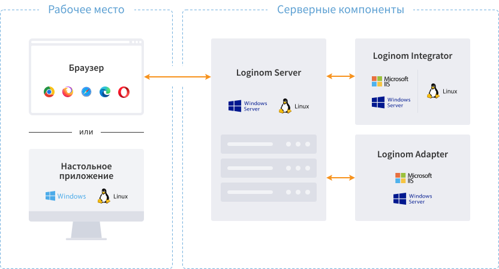

# Loginom — User Manual

[**Loginom**](https://loginom.ru) is an analytical platform that enables to execute all business analysis stages in a uniform environment, from data consolidation and model training to visualization and integration into a business process.

Loginom Desktop operation is similar to the Studio operation, with the exception of unavailable mechanisms of integration and teamwork.

| Component functionality | Desktop | Studio |
|:-------------|:------:|:-------:|
| [Workflow design](./workflow/README.md) | • | • |
| [Data processing](./processors/README.md) | • | • |
| [Visualization](./visualization/README.md) | • | • |
| [File management](./location_user_files.md) | | • |
| [Administration](./admin/README.md) | | • |
| Multiuser operation | | • |
| [Integration](./integration/README.md) | •/- | • |

Six editions of the [Loginom](https://loginom.ru) platform are available:

* Community Edition
* Personal
* Team
* Standard
* Enterprise
* Cloud

To choose the suitable edition, consider use cases and integration into the corporate IT environment, not the availability of processing algorithms and visualization methods, which are the same in all versions.
A more detailed description of the editions is provided in the article "Compare Editions".

**See also:**

* [Official vendor's website](https://loginom.ru);
