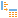

#  Tree to Table

Компонент преобразует данные, представленные в иерархической древовидной форме, в таблицу. The selected nodes will be organized in columns of the output data set.

### Input

 **Input tree**: the data set in the hierarchic tree-like form.

### Output

 **Output data set**: data table.

## Wizard

### Configuration of the Input Data Set

Данные во входном порте узла представлены в виде входного и выходного наборов.

The Input Tree list displays fields of the data set accepted by the port. It is required to map them with fields of the data set supplied by the port for processing - Output Tree (refer to [Ports](./../../workflow/ports/README.md)).

It is possible to set the structure of the set supplied for processing in the manual way, or to download it from the *.xsd file.

#### Manual Setting of the Nodes Structure

При ручном формировании структуры набора, который впоследствии будет подан на обработку, используются команды панели инструментов или контекстного меню.

The toolbar and context menu of the Input Tree list contains the following commands:

*  **Check all** enables to check all nodes.
*  **Deselect all** enables to deselect all nodes.
*  **Invert selection** enables to invert the selected nodes to unselected and vice versa.

Для списка Выходное дерево на панели инструментов и в контекстном меню доступны команды:

*  **Add child node** enables to add the child node to the root node.
*  **Add neighboring node** enables to create the node of the same hierarchic level as provided for the selected one.
*  **Edit...** enables to call the editing window and change values of the fields for the selected node (the command can be called using *F2* hotkey).
*  **Move up**  and   **Move down** enable to change the order of nodes. In this case, it is not possible to move the **Root** root node (the commands are also available when using *Ctrl+Up* and *Ctrl+Down* combinations of hotkeys, correspondingly).
*  **Load from XSD...** enables to load the structure of nodes of the output tree from the XSD file.
*  **Map fields** enables to map a list of output port fields to a list of the input ones (the mapping algorithm is described in the [Automapping of Fields](./../../workflow/ports/automapping-of-fields.md)).
*  **Automapping**: when enabling this mode,  **Map fields** command will be automatically performed during the node execution (enabled by default).
*  **Delete** enables to delete the child node of the tree, this command icon is highlighted when hovering a cursor over the node (the command can be also called by *Delete* hotkey).
* **Delete all...** enables to delete all child nodes (combination of *Shift+Delete* hotkeys).

> **Note: It is not possible to delete ** Delete root node **Root**.

When running the following commands:   **Add child node**,  **Add neighboring node**,  **Edit...**, the following fields values are set:
* **Name**: the unique column name for one data set. It can consist of the following characters:
   * Capital or low case Latin characters.
   * Underscore characters.
   * Digits (it cannot be the first character).
* **Caption**: random field description.
* **Data type**: one of the possible [data types](./../../data/datatype.md).
* **Data kind**: one of the possible [data kinds](./../../data/datakind.md).

Besides, it is possible to set the following indicators:
* **Array**: when selecting the checkbox, the selected child node will be defined as ordered set (array) of one data type.
* **Container**: when selecting the checkbox, the selected child node will be a root node for other created child nodes of different types.

It is possible to filter records in the Input Tree and Output Tree lists using **Filter** command of corresponding toolbar.

#### Loading of the Nodes Structure from the XSD Schema

The output tree structure can be loaded from the XSD file using  **Load from XSD...** command.

It is possible to fill in the following fields in the appeared dialog window:

* **XSD file**: the field for the file selection (not edited).
* **Namespace** enables to select a namespace from a list of all namespaces described in the XSD file. It limits selection of the root element only by the specified space. The value of *All namespaces* is set by default.
* **Root element** enables selection of the root node from the list in the loaded file. The value of the first root node of the selected file is set by default.
* **Recursive depth** provides the maximum number of recursions when opening recursive nodes. It is selected in the range from 0 to 3. By default, it is equal to 1. It means that every recursive node will be automatically opened but recursive nodes inside these nodes will be left unopened. Additional opening of recursive nodes is possible in the manual mode upon tree building. In the case of 0 value recursive nodes won't be automatically opened.

After filling in all the fields, it is required to press **Load** button, and the XSD schema will be loaded for further work.

#### Fields Mapping

To map the fields of the input and output tree, it is required to establish links between them. It can be done using **Auto link** button. The input and output fields will be linked, if their names and data types coincide.
Links can be also established in the manual way using the *Drag-and-drop* method by dragging the item from the left list to the item from the right list. In this case, fields names are not important. However, data types must still coincide.

It is possible to delete the links between nodes as follows:
* using  **Delete all links** button, it deletes all links;
* using  button in the line (when cursor hovering, the button is changed to ).

### Selection of the Tree Nodes

Мастер настройки узла представляет собой отображение дерева (дерево, поданное на выход входного порта) с возможностью выбора некоторых или всех узлов. The selected nodes will be organized in columns of the output data set.

Available actions are represented in the form of the toolbar buttons and in the context menu:

*  **Check all** enables to check all nodes.
*  **Deselect all** enables to deselect all nodes.
*  **Invert selection** enables to invert the selected nodes to unselected and vice versa.

Пометить выделенный узел можно нажав клавишу *Enter*, повторное нажатие *Enter* снимает выделение.

Logics of Nodes Selection:

* When selecting a node, its parents are also selected, up to its root.
* When branch deselecting, all its descendants are deselected.
* Global node index: the node is absent in the tree-like data structure. However, it appears in the tree view and points to the index used in the array node. It can be selected but the array node can be selected as well.
   The node gets -1 index that is taken into account when sorting.
   When selecting the node, a column with the array node name with "_global_index" added and the array node caption with "|Global index" added is generated for it.

> **Important:** The component will throw an error message when leaving the configuration page or when executing if it doesn't have selected nodes.

**Repeat parent node values**: if there are a parent node and a sequence of descendants in the structure, the parent node value will be repeated for each string generated from a sequence of descendants.

**Generate composite field captions**: if this checkbox has been selected, the composite array node caption is used. Hierarchy relative to the root element will be displayed in the field captions.
