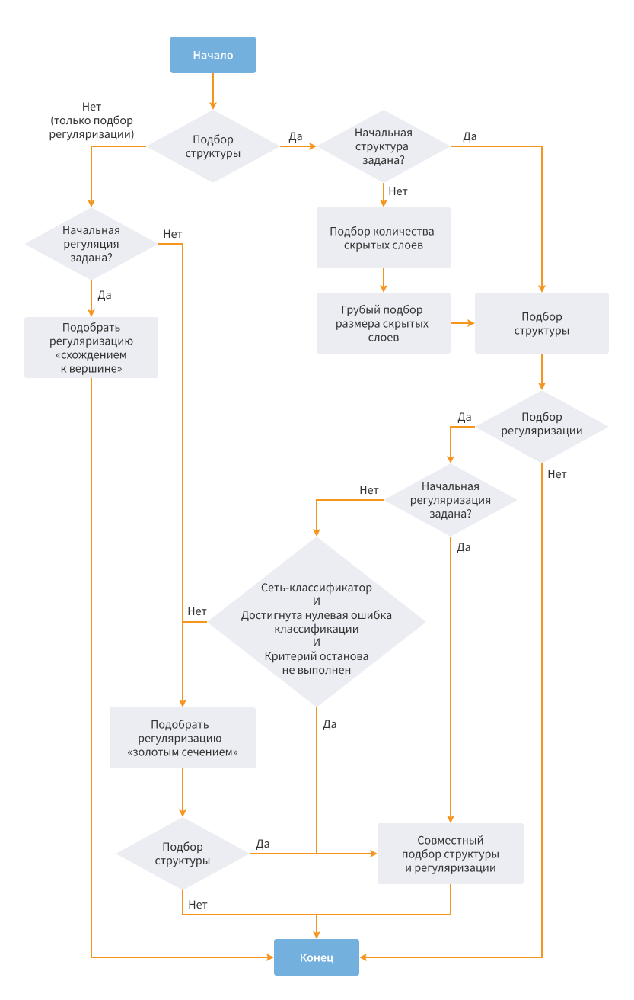

#  Neural Network (Classification)

## Description

Компонент решает задачу [классификации](https://wiki.loginom.ru/articles/classification.html) — в выходном наборе [*Нейросеть*](https://wiki.loginom.ru/articles/neural-network.html) соотносит множество [входных параметров](https://wiki.loginom.ru/articles/input-variable.html) (предикторов) с одним из заранее известных [классов](https://wiki.loginom.ru/articles/class.html):

**{** P(1), P(2), P(3) ... P(n) **}** => Class(i) where P(n) — input parameter, Class(i) — one of the classes known in advance.

Перед тем, как производить классификацию, алгоритм обучается на тренировочном наборе данных — [обучающей выборке](https://wiki.loginom.ru/articles/training-set.html). Each row of such sample contains the following data:

* a set of input parameters in the fields marked as the *input* ones;
* class identification mapping this set in the only *output* field.

Таким образом, перечень классов задается обучающим набором данных в процессе обучения *Нейросети* и не может быть изменен/пересмотрен в процессе классификации.

Технически обучение заключается в нахождении *весов* — коэффициентов связей между нейронами. В процессе обучения нейронная сеть способна выявлять сложные зависимости между входными и [выходными параметрами](https://wiki.loginom.ru/articles/output-variable.html), а также выполнять обобщение. It means that on condition of the successful training, the network can return the correct result based on the data that was absent in the training sample, and also incomplete and/or "noisy", partially distorted data. Для обучения используется квазиньютоновский [метод Бройдена-Флетчера-Гольдфарба-Шанно](https://ru.wikipedia.org/wiki/Алгоритм_Бройдена_—_Флетчера_—_Гольдфарба_—_Шанно) с ограниченным использованием памяти *L-BFGS*.

В задаче классификации (в отличии от [задачи регрессии](./../../processors/datamining/neural-network-regression.md)) выходным может быть только поле с дискретным [видом данных](./../../data/datakind.md). Data kind of input fields is not regulated, they can be both continuous and discrete.

> **Примечание:** для каждого непрерывного параметра в структуре *Нейросети* будет создан один вход, в то время как для каждого дискретного – столько входов, сколько у данного параметра имеется различных уникальных значений.

## Ports

### Input

*  Input data source (data table).

#### Requirements to the Received Data

The input data set fields that will be used as the *input* or *output* ones, must not contain null values. If this requirement is not met, error message will appear when node activating.

### Output

*  [Выход нейросети](./neural-network-classification/output-set.md) (таблица данных).
*  [Сводка](./neural-network-classification/report.md) (переменные) — показатели качества модели.

## Wizard

### Step 1. Configure input columns

На первом этапе необходимо задать [назначение](./../../data/datasetfieldfeatures.md) полей входного набора данных:

*  **Input**: the field contains the values of one of the input parameters.
*  **Output**: the field contains the class values.
*  **Не задано** — поле не участвует в обработке. It is set for other fields by default.

### Step 2. Configuration of Normalization

На этом этапе входные данные приводятся к нормальному виду — преобразуются из натуральных значений в безразмерные для того, чтобы данные, имеющие большой разброс значений, не превалировали над данными с меньшим разбросом значений. Использование [нормализации](./../normalization/README.md) увеличивает качество и скорость обучения *Нейросети*.

### Step 3. Partitioning

Страница *Разбиение на множества* позволяет разделить множество на обучающее и тестовое:

* [Train](https://wiki.loginom.ru/articles/training-set.html): the structured data set used for training of [analytical models](https://wiki.loginom.ru/articles/taught-model.html). Each record of the training set is a training example with the set input effect and correct output (target) result that corresponds to it.
* [Test](https://wiki.loginom.ru/articles/test-set.html): the training sample subset that contains test examples, namely, the examples used not to train the model but to check its results.

Available Parameters:

* Size of training and test set in percentage terms or in rows.
* Method of partition to training and test sets. Существует три метода разбиения:
   * Random method provides partitioning of records set to training and test sets.
   * Sequence: groups of sets rows (training, unused, test) are selected in a sequential order, namely, only the records that are included into the first set are selected first, then it is required to select the records that are included into the second set, etc. It is posssible to change the order of sets (*Move up*, *Move down* buttons).
   * По столбцу — разбиение на обучающее и тестовое множества задаётся при помощи параметра. Параметром выступает столбец с логическим типом данных, где значение &laquo;ИСТИНА&raquo; указывает на то, что запись относится к тестовому набору, а значение &laquo;ЛОЖЬ&raquo; — на то, что запись принадлежит обучающему набору (т.е. можно разбить множество на обучающее и тестовое в узле [Разбиение на множества](../preprocessing/partitioning.md) и подать данные из порта *Общий выходной набор* на вход узла *Нейросеть (классификация)*, выбрав в качестве параметра разбиения по столбцу колонку "Тестовое множество"). При выборе данного метода таблица выбора соотношения обучающего и тестового множеств становится неактивной.
* [Validation](./../validation.md) method that can take the following values:
   * No validation.
   * [K-fold cross validation](https://wiki.loginom.ru/articles/cross-validation.html) enables to select the *Method of [sampling](https://wiki.loginom.ru/articles/sampling.html)* and number of *Cross validation fold*.
   * [Monte Carlo](https://wiki.loginom.ru/articles/monte-carlo-technique.html?q=) enables to select *Resampling iteration count* and set the size of training and [validation set](https://wiki.loginom.ru/articles/validation-set.html).

**Random seed** — начальное число (целое, положительное), которое используется для инициализации генератора псевдослучайных чисел. Последовательность чисел генератора полностью определяется начальным числом. Если генератор повторно инициализируется с тем же начальным числом, он выдаст ту же последовательность чисел.

Параметр влияет на порядок случайного разбиения на тестовое и обучающее множество и на воспроизводимость результата обучения. Можно повторить результат обучения узла, если подать те же данные и выставить тот же random seed.

Для параметра доступны следующие команды:

* Всегда случайно — начальное число всегда будет случайным.
* Генерировать — сгенерируется новое начальное число.
* Копировать — в буфер обмена будет скопировано указанное значение.

### Step 4. Configure Neural Network Parameters

#### Структура Нейросети

* **Количество скрытых слоев** — предоставляется выбор из списка:
   * No hidden layers.
   * One hidden layer (used by default).
   * Two hidden layers.
* **Количество нейронов в первом скрытом слое** — целое число >= 1 (по умолчанию = 10).
* **Количество нейронов во втором скрытом слое** — целое число >= 1 (по умолчанию = 10).

#### Training Parameters

* **Количество рестартов** — число попыток обучения *Нейросети* (на одном и том же наборе), выполняемых из случайных начальных значений весов. Upon completion of all restarts, it is required to select the network that provides the least root-mean-square error of the training set. Целое число >= 1 (по умолчанию = 10).
* **Степень регуляризации** — степень зависимости весов сети друг от друга. The higher this dependence, the stronger impact exerts one input parameter on the other ones. The decay enables to decrease the effective number of the model degrees of freedom, thereby avoiding overfitting. The following options are available:
   * None (0).
   * Very weak (20).
   * Weak (40). It is used by default.
   * Mean (60).
   * Strong (80).
   * Very strong (100).
* **Продолжить обучение** — установка данного флага позволяет начать переобучение модели не со случайных значений весов *Нейросети*, а с полученных при последнем обучении. При этом параметр *Количество рестартов* игнорируется.

#### Stop Criteria

The network is trained in the iterative manner. The whole training data set is read for each iteration, and the *Neural Network* weights are changed. Это продолжается до тех пор, пока относительные изменения весов не станут меньше заданного порога или количество итераций не превысит заданной величины.

* **Порог минимального изменения весов** — если на очередном шаге обучения относительное изменение нормы вектора весов становится меньше порога, то обучение останавливается. По умолчанию = 0,005.
* **Максимальное количество эпох** — максимальное количество итераций обучения алгоритма. If it is required to limit the training process in time, in this case, it will be stopped upon the set number of epochs even if the training has not reached the optimal point, namely, the minimum weight change threshold has not been reached yet.

### Шаг 5. Configure Auto Selection of Neural Network Parameters

Three structure related parameters can be selected for the neural network:

* Number of hidden layers (0, 1 or 2).
* Number of neurons in each hidden layer.
* **Степень регуляризации** — параметр, регулирующий жесткость модели.

#### Common Parameters

* **Подобрать структуру** — автоматический подбор структуры *Нейросети*:
   * **Начать с указанной структуры** — использование в качестве начальных параметров значений, заданных на странице настройки параметров *Нейросети*.
* **Подобрать степень регуляризации** — автоматический подбор степени регуляризации *Нейросети*:
   * **Начать с указанной степени регуляризации** — использование в качестве начальной *Степени регуляризации* значения, заданного на странице настройки параметров *Нейросети*.

> **Примечание:** если необходимо осуществлять подбор параметров для больших входных объемов или сложных моделей, можно включить только подбор структуры, либо только подбор степени регуляризации, сократив время на обучение.

#### Sampling Parameters

To speed up the autofit process, it is required to set the subsample in which it will be performed:

* **Использовать подмножество обучающего набора** — использование подвыборки обучающего множества для автоподбора.
   * **Размер выборки в процентах** — размер подвыборки обучающего множества.
   * **Maximum sample size**: the maximum size of the training set subsample.

#### Auto Stop Criteria

The auto selection process is stopped by default if it is not possible to find better parameters as compared with the detected ones. Для ограничения времени работы предусмотрена возможность ограничить, в том числе одновременно количество шагов автоподбора и время автоподбора:

* **Autofit stages not more**: the maximum number of the algorithm steps (0 — restrictions are disabled).
* **Autofit time not more (s)**: the maximum algorithm operation time (0 — restriction is disabled).

> **Примечание:** при работе следует учитывать, что фактически оба ограничения могут быть незначительно превышены при использовании подвыборки для автоподбора, так как последним этапом, который не учитывается ограничениями, будет осуществлено обучение лучшей *Нейросети* на полном наборе.

The optimizer is stopped in some specific cases if, from a theoretical standpoint, the best result is reached. It is the root-mean-square error of the training set equal to 0 both for regression networks, and for the classifier.

By default, *Stop at zero classification error* is also enabled for the classifier:

* **Stop at zero classification error** enables to stop autofit when reaching zero classification error.

> **Примечание:** опцию *Останов при нулевой ошибки классификации* можно отключить,
> т.к. правильная классификация всех примеров не всегда означает наилучшую структуру *Нейросети*: оптимизатору можно дать возможность подобрать сеть с лучшей обобщающей способностью (например, с меньшим числом нейронов или сильнее регуляризованную), но при этом не обязательно с нулевой ошибкой классификации.

#### Optimization Strategy

The root-mean-square error of the training set is a target function for the optimizer. Under these circumstances, to take into account the cases when several networks provide the results comparable in accuracy, in order to select the network with the simplest structure, the target function value is additionally fined by the multiplier (1+1e-8) slightly different from 1 for each hidden neuron.

The following optimization strategy is used:

* If it is required to select only the decay degree for the set structure:
   * Если начальная точка не задана, то степень регуляризации подбирается методом *золотого сечения*, в противном случае — методом *схождения к вершине*.
* Если необходимо подобрать только структуру, не изменяя степень регуляризации:
   * Если не задана начальная структура, то она подбирается в два этапа: сначала происходит выбор количества скрытых слоев (0, 1 или 2), затем, если результат предыдущего этапа не 0, грубо подбирается размер скрытых слоев методом *золотого сечения*, причем для 2 скрытых слоев количество нейронов на данном этапе делается одинаковым.
   * Структура подбирается сразу по всем трем параметрам (число слоев, число нейронов) методом *схождения к вершине* из заданной либо подобранной начальной точки.
* If autofit of structure and decay is required:
   * The structure is selected as in the previous clause. При этом, если начальное значение регуляризации задано, то используется оно, в противном случае — регуляризация отключена.
   * Если начальное значение регуляризации не было задано, оно подбирается методом *золотого сечения*.
   * Финальный этап автоподбора производится методом *схождения к вершине* по всем четырем параметрам.

   Блок-схема (граф переходов) реализованной стратегии автоподбора указана на рисунке:

*Рисунок 1. Алгоритм автоподбора*
