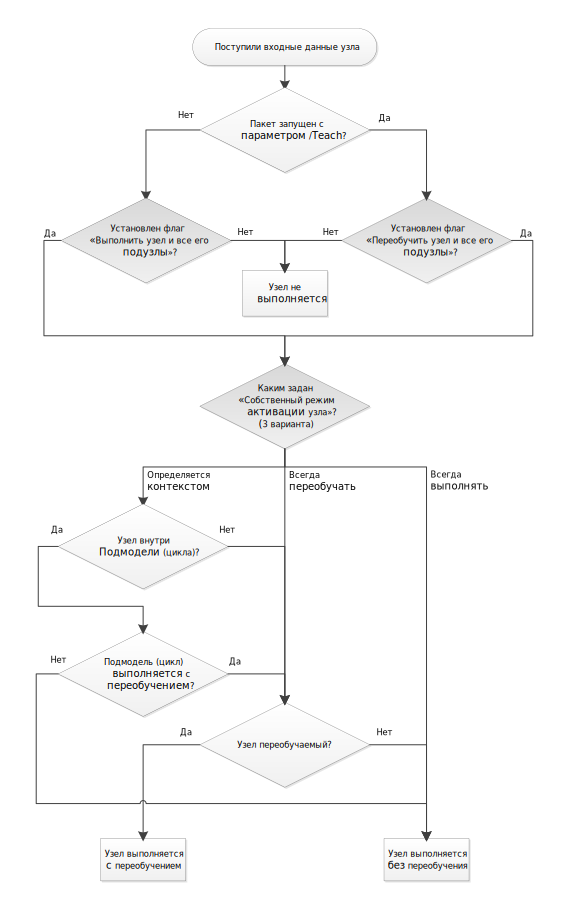

# Node Activation Mode

## Node Activation Options

* [Batch processing of workflow](#paketnoe-vypolnenie-stsenariya);
* [Interactive workflow execution](#interaktivnoe-vypolnenie-stsenariya).

### Batch Processing of Workflow

The following execution options can be set for each of the nodes in the case of the Workflows batch processing:

* The node will not be executed.
* The Node is executed without retraining of the Model.
* The Node is executed with retraining of the Model.

Selection of one of these options of the node behaviour *in the case of the batch processing* is set as follows:

* By the context within which the Workflow node execution is launched. The context within the scope of the Workflows batch processing means as follows:
   * Parameters of the Package execution launch. The following factors are important:
      * Launch of the Package with */Teach* parameter or without it.
      * Launch of the Package with */Node* parameter.
* By configuration of the node activation mode of the [Supernode](../processors/control/submodel.md) ([Loop](../processors/control/cycle.md)) that contains the executed node (if it is available).
* By configuration of the activation mode set for the executed node as such.

> **Note:** More detailed information on the batch processing of workflows and */Teach* and */Node* batch processing parameters is provided (refer to [batch processing of workflows](./batchlauncher.md)).

### Interactive Workflow Execution

The following execution options can be set for each of the nodes in the Workflows editing (debugging) mode:

* The Node is executed without retraining of the Model.
* The Node is executed with retraining of the Model.

Selection of one of these options of the node behaviour *in the case of the interactive execution* of the Workflows is set as follows:

* By the context within which the Workflow node execution is launched. The context within the scope of the interactive execution of Workflows means as follows:
   * The command that enables to launch the node execution or the Supernode (Loop) node that contains it. The following options are possible:
      * Execution of "Retrain node" command.
      * Execution of "Run node" command.
* By configuration of the Supernode (Loop) node activation mode that contains the executed node (if it is available).
* By configuration of the activation mode set for the executed node as such.

## Configure Activation Mode

### Valid Modes of Batch Processing

This group of parameters has an impact on the node activation mode only in the batch mode.

* **Run node and all its subnodes**: the checkbox enables to define whether the node will be activated in the case of the batch Workflow launch without retraining (without /Teach parameter). It is required to disable this mode not to activate the node and all its subnodes while batch processing.
* **Retrain node and all its subnodes**: the checkbox enables to define whether the node will be activated in the case of the batch Workflow launch with retraining (with /Teach parameter). It is required to disable this mode not to retrain the node and all its subnodes while batch processing.

Both options are enabled by default for new nodes.

### Own Node Activation Mode

This parameter has an impact on the node activation node both in the batch mode, and in the interactive mode.
Using the own activation mode, it is possible to set the execution mode forcibly with or without retraining. It is required to select one of the options listed below:

* **Always execute**: the node is always executed without retraining.
* **Always retrain**: the node is always executed with retraining.
* **Defined by the context of the current processing process** (it is always used by default): the execution mode with retraining ("Always retrain") or without retraining ("Always run") is defined by the following factors:
   * if the node is in the Supernode or Loop, the execution mode is inherited from them.
   * in other cases, the following set execution order is used:
      * in the case of the Workflow batch processing - by */Teach* parameter;
      * in the case of the interactive Workflow execution - by the command that is used to launch the node execution ("Retrain node" or "Run node").

> **Note:** As the Supernode (or Loop) also can be nested into another Supernode, and this nesting is not limited, the nesting hierarchy can be created in this case. The upper level Supernode is located on its top. By default settings of this Supernode are inherited by all subordinate nodes. Thus, the own node execution mode can be inherited from the Supernode of the highest level.

The following *flowgraph* (refer to Figure 1) shows which of the node execution options according to the settings specified above will be used for the batch processing:

> **Note:** It is required to take into account that the node cannot be executed during the workflow batch processing in the following situations:

* The definite node that will be executed is specified in the batch processing launch parameters(refer to [*/Node*](./batchlauncher.md) parameter). In this case, only the node specified in the parameters and all *its preceding nodes *, namely, all the nodes that take part in generation of the input data for it are executed. Other Package nodes will not be executed.
* One of the preceding nodes is not executed. In this case, the input node data cannot be generated, and it means that the node cannot be executed.