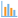

#  Chart

The chart visually shows dependence of values of one field on the other one. Two-dimensional chart is the most widely used type of charts. The independent column values are set on its horizontal axis, and the dependent column values that comply with them are set on its vertical axis.

## Interface

### Operations

*  **Настройка полей** — показать/скрыть список полей набора данных.
*  [**Общие настройки**](./general-settings.md) — настройки диаграммы в целом. It is possible to open the configuration window using the toolbar or by double clicking on the charting area with the left mouce button. Часть общих настроек (*Нормировать*, *Горизонтальная ориентация*, *Навигатор*) вынесена на панель инструментов.
*  [**Настройки серий**](./series-settings.md) — настройки списка серий и параметров конкретных серий (графиков).
*  [**Настройки осей**](./axis-settings.md) — позволяет задать параметры соответствующим осям диаграммы.
*  **Нормировать** — приводит все графики к одному масштабу.
*  **Горизонтальная ориентация** — меняет местами оси, то есть поле по X перемещается на ось Y, и наоборот ось Y становится осью X.
*  **Навигатор** — позволяет детализировать по оси X какой-либо участок диаграммы, отображается снизу под осью. Moving the navigator edge, it is possible to select the required chart area.
*  **Режим приближения** — увеличивает масштаб просмотра выделенной области (см. также [Работа с построенной диаграммой](#rabota-s-postroennoy-diagrammoy)).
*  **Режим перетаскивания** — позволяет передвигать диаграмму по экрану (см. также [Работа с построенной диаграммой](#rabota-s-postroennoy-diagrammoy)).
*  **Приблизить** — приближает/увеличивает область диаграммы.
*  **Отдалить** — отдаляет/уменьшает область диаграммы.
*  **Сбросить масштаб** — снимает все настройки масштабирования (по обеим осям).
*  **Сбросить масштаб Y** — снимает масштабирование диаграммы по оси Y, но оставляет приближение по оси X.
*  **Экспорт** — позволяет сохранить диаграмму, как она выглядит в окне просмотра в файл с изображением. The name of the format that has been selected for export will be displayed in this menu option:
   * Export to SVG;
   * Export to PNG;
   * Export to JPG;
   * Export to PDF.

### Chart Configuration

The fields that can be used as the chart axes are displayed in the left list. For this purpose, it is required to drag (Drag&Drop) necessary fields to the chart construction area holding down with the left mouse button: to the upper part - the Y axis is set, to the lower part - the X axis is set. When setting the Y axis, the series addition is configured, namely:

* **Type**: the chart type is set.
* **Name**: series name (namely, the definite graphic chart). This name will be displayed in the chart legend.
* **Y field**: the field is set for Y axis.
* **Color field**: the numeric field that is projected onto the color chart.

When configuring the X axis settings, it is also possible to use the buttons in the fields list (to the right from the field name):

*  Use as abscissa field (Alt+X);
*  Use as caption field (Alt+L).

Thus, the X axis values field and caption field (the axis points marks) must not necessarily coincide.

The following types of charts are available:

*  Lines.
*  Areas.
*  Splines.
*  Columns.
*  Interval areas.
*  Smoothed areas.
*  Smoothed areas with intervals.
*  Bubble.
*  Scatter.
*  Waterfall.
*  Errors.
*  Polygon.
*  Columns with ranges.
* Heatmap.

> **Примечание:** все диаграммы строятся на принципе — одному значению X соответствует **только одно** значение Y.

All main settings are available either using the context menu options (it is required to press the chart area with the right mouse button), or the toolbar buttons (in the upper part over the chart).

### How to Use the Constructed Chart

When using the chart, it is possible to zoom in the view of the whole chart or its random part. Для этого на панели инструментов нужно сделать активным  *Режим приближения* и далее следует, удерживая левую кнопку мыши нажатой, выделить ту область диаграммы, которую нужно просмотреть более детально. As soon as the mouse button is released, it will be possible to zoom in the selected area view. The procedure is to be repeated to zoom in again.

Чтобы детальнее рассмотреть диаграмму при заданном увеличении, необходимо сделать активным  *Режим перетаскивания*. It will enable to move the chart on the screen.

Чтобы вернуться к исходному масштабу диаграммы, нужно воспользоваться функцией  *Сбросить приближение*.