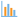
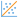

#  Chart

The Cube chart represents the chart of the given type constructed on the Cube basis. As opposed to the standard one, it clearly matches the current state of the Cube, and in the case of all its changes, it changes correspondingly. It is possible to activate the chart view using  **Chart** button on the Cube [Toolbar](./toolbar.md). The general chart view is provided on Figure 1.

The cube chart has its own Toolbar that contains the following buttons:

* **Chart type** enables to select the type of the displayed chart:
   *  **Lines**.
   *  **Areas**.
   *  **Splines**.
   *  **Columns**.
   *  **Smoothed areas**.
   *  **Scatter**.
* **Series position** enables to select position of series:
   *  **In columns**: construction of the chart series according to the column data.
   *  **In rows**: construction of the chart series according to the row data.
* **Show totals**: not to show the series generated on the basis of the final headers:
   *  **Hide**.
   *  **Show**.
* **Displayed measure** enables to select the displayed measure from the list.
*   **Restrictions** enable to set restrictions concerning the number of series/points:
   * **Series**: the number of displayed series. It is possible to specify from 1 but not less than the count of unique values of dimensions in the cube rows up to 100 inclusively.
   * **Points**: the number of displayed points. It is possible to specify from 1 but not less than the count of unique values of dimensions in the cube columns up to 1000 inclusively.
* **Export** enables to export the chart to the given format:
   * **PNG**.
   * **JPEG**.
   * **PDF**.
   * **SVG**.

When hovering cursor over the series point, the tooltip with value appears. To disable the series, it is required to press it on the chart legend.
