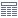
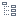
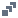

#  Отчет по регрессии

Визуализатор *Отчет по регрессии* компонента [*Линейная регрессия*](./../../processors/datamining/linear-regression/README.md) отображает параметры и результаты статистических тестов для анализа регрессионных моделей.

Данный визуализатор состоит из трех областей:

* [Информации о модели](#informatsiya-o-modeli);
* [Коэффициентов регрессии](#koeffitsienty-regressii);
* [Шагов построения](#shagi-postroeniya).

Подробно о том, как включить данный визуализатор, можно прочитать в [статье](./../README.md).

## Интерфейс
### Операции

#### Область Информация о модели

*  **Информация о модели** — отображение/скрытие [информации о модели](#informatsiya-o-modeli).

#### Область Коэффициенты регрессии

*  **Таблица** — переключение отображения [коэффициентов регрессии](#koeffitsienty-regressii) в вид *Таблица*;
*  **Дерево** — переключение отображения [коэффициентов регрессии](#koeffitsienty-regressii) в вид *Дерево*;
*  **Нулевые значения** — отображение/скрытие нулевых значений.

#### Область Шаги построения

*  **Шаги построения** — отображение/скрытие [шагов построения](#shagi-postroeniya) модели.

### Области визуализатора

#### Информация о модели

Описание показателей модели представлено в таблице:

|Показатель|Описание|
|:------------------------|:-----------------------------------------------|
| Константа|[Зависимая переменная](https://wiki.loginom.ru/articles/output-variable.html)|
| -2 Log Likelihood|-2 Логарифма [функции правдоподобия](https://wiki.loginom.ru/articles/plausibility-function.html)|
| R2|[Коэффициент детерминации](https://wiki.loginom.ru/articles/coefficient-of-determination.html)|
| R2 корр.|[Коэффициент детерминации скорректированный](https://wiki.loginom.ru/articles/coefficient-determ-adj.html)|
|[Число степеней свободы](https://wiki.loginom.ru/articles/degrees-of-freedom.html)|Число независимо варьируемых значений признака|
| [Значимость](https://wiki.loginom.ru/articles/significance-regr.html)|Степень статистической связи между [входной](https://wiki.loginom.ru/articles/input-variable.html) (набором входных) и [выходной переменными](https://wiki.loginom.ru/articles/output-variable.html)  регрессионной модели|
| AIC|[Информационный критерий Акаике](https://wiki.loginom.ru/articles/aic.html)|
| AICc|[Информационный критерий Акаике скорректированный](https://wiki.loginom.ru/articles/aicc.html)|
| BIC|[Информационный критерий Байеса](https://wiki.loginom.ru/articles/bic.html)|
| HQC|[Информационный критерий Ханнана-Квина](https://wiki.loginom.ru/articles/hq.html)|

#### Коэффициенты регрессии

Описание коэффициентов представлено в таблице:

|Коэффициент|Описание|
|:--------------------|:----------|
|Коэффициент|Характеристика связи между зависимой *y* и [независимой переменной](https://wiki.loginom.ru/articles/input-variable.html) *x*|
|[Стандартная ошибка](https://wiki.loginom.ru/articles/standard-estimation-error.html)|Мера разброса данных наблюдений от смоделированных значений|
|Т-статистика|Отношение стандартной ошибки оценки коэффициента к его абсолютной величине.|
|[Значимость](https://wiki.loginom.ru/articles/significance-regr.html)|Степень статистической связи между входной (набором входных) и выходной переменными регрессионной модели|

Коэффициенты регрессии могут быть представлены в виде  *Таблицы* (см. рисунок 1) или  *Дерева* (см. рисунок 2). 

#### Шаги построения

Область  *Шаги* построения имеет смысл включать только в том случае, если при настройке узла Логистическая регрессия в параметре Отбор факторов и защита от переобучения был выбран алгоритм, который подразумевает режим обработки фактов.

Область  *Шаги построения* состоит из следующих полей:

|Поле|Описание|
|:----------------|:----------------------------------------------------------------------------|
|Модель| Дерево моделей, в котором отображаются созданные алгоритмом модели в процессе обучения. Оно появляется тогда, когда отбираются факты. Для алгоритмов, которые не поддерживают обработку фактов, в этом поле будет только одна финальная модель. Щелчком левой кнопки мыши по области  *Шаги построения* можно выбрать отображение [информации о выбранной модели](#informatsiya-o-modeli) (если установлен соответствующий флажок), а также [коэффициенты регрессии](#koeffitsienty-regressii). |
|Показатель|Значение выбранного показателя для текущей модели|
|Изменение поля|Отображает добавлен или удален был факт ("+" означает, что факт был добавлен в модель, а "-" показывает, что факт удален из модели)|
|Поля|Текущие поля модели|

Существует три вида моделей:

* **Нулевая модель** — начальная модель работы алгоритма;
* **Промежуточная модель** — модель, которую создал алгоритм в процессе обучения;
* **Финальная модель** — модель, которую алгоритм посчитал наилучшей, и дальнейшие действия не приведут к улучшению модели.

Доступные для выбора показатели:

* -2 Log Likelihood;
* AIC;
* AICc;
* BIC;
* HQC.