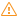

# Derived Component

## Description

**Derived component** is the component created by a user than can be used in the Workflows alongside with the standard components provided by the platform. The data processing algorithm, input and output ports of the derived component are set by the *base node*.

Any node can be the base node with the exception of [Loop](../processors/control/loop.md), [Node execution](../processors/control/execute-node.md), [Reference node](../processors/control/reference-node.md), reference derived node for *Connection*. But generally the [Supernode](./../processors/control/supernode.md) is used. As it is possible to use the random logics of data processing in the Supernode and set the required input and output ports, a user has an opportunity to create the Derived Component with the universal feature on its basis. It will be suitable for the multiple use in different analytical tasks. Thus, a set of tools for implementation of different data processing logics is not limited by the standard platform components, and it can be expanded by users. Such approach is an important tool used to implement the structural approach when designing complex solutions (refer to [design tool](./../quick-start/design-principles.md)).

The following properties are peculiar to the derived component:

* **Heritage** means that the base node change will cause the Derived Component change, and, correspondingly, all Workflow nodes created on the basis of this component.
* **Overdetermination** means the modification of the derived node without change of the Derived Component from which it has been created.

From the *Derived Components* the *derived nodes* are created. They are descendants of the base node.
The inheritance is performed using the mechanism of the derived nodes update when changing the base one. When introducing changes into the base node in all derived nodes inherited from it, the following notification will appear:  "Base node was changed...". These changes will be applied to the derived nodes:
* when selecting *Update node configuration* menu option in the context menu of the derived node;
* when activating, retraining, calling the wizard of the derived node or its ports.

The base node is unchanged in the case of overdetermination of properties and settings of the derived nodes. If the base node settings are changed, only the settings that have not been overdetermined by a user will be updated in the derived node. The list of the changes prohibited in the case of the derived node overdetermination is provided below.

The list of the changes prohibited in the case of the derived node overdetermination:

| Inherited node | Object | List of Prohibited Operations |
| :-------- |:-------- | :-------- |
| All nodes | Columns and variables in the input and output ports | <ul> <li>Delete</li> <li>Change data type</li> <li>Change name</li> </ul> |
| Supernode | Supernode nodes | <ul> <li>Replacement of the connection node with the inherited node</li> </ul> |
| | Connections | <ul><li>Delete</li></ul> |
| | Derived components | <ul><li>Deletion, replacement of the base node</li></ul> |
| Nodes with the variable number of ports, including the Supernode | Input and output ports | <ul><li>Delete</li> <li>Change type</li> <li>Change name</li></ul> |

To cancel all changes introduced into the derived node forcibly and to make the derived and base nodes identical, it is required to select *Restore the source node configuration* item in the context menu of the derived node.

> **Важно:** При переопределении и наследовании настроек базового узла необходимо учитывать что именно является атомарным объектом переопределения и наследования. Например, в условии фильтрации `< 01.01.2020` присутствуют две атомарные части: `<` и `01.01.2020`. В этом случае к каждой из этих частей механизмы переопределения и наследования применяются отдельно, а не ко всему условию в целом. Это означает, что при переопределении одной из них, другая может быть изменена механизмом наследования при изменении базового узла.
>
> В разных компонентах атомарными могут быть как отдельные настройки, так и группы настроек.

## Creation and Configuration of the Derived Component

To create the Derived Component, it is required to select the base node (Supernode) and  *Create derived component* item in its context menu. The same command is available on the toolbar of the Workflows construction area.

*Configuration of the derived component* window where the following parameters are defined will be opened:

* **Caption**: name of the derived component.
* **Description**: additional information on the component.
* **Visibility area**: availability of the Derived Component on different Package levels is set by the radio button:
   * Private (available only in the current Module);
   * Partially private (available only in the current Module and its Supernodes);
   * Public (available only in the current Package);
   * Public (available in all packages): to use the Derived Component from the other package, it is required to create the Reference to the Package (refer to the [access modifier](./access-modifier.md)) in which the Derived Component has been created.
* **Целевые типы узлов** — типы узлов, которые можно создавать по производному компоненту (по умолчанию выставлен флаг у *Выполнение узла* и *Цикл*, хотя бы один флаг должен быть выставлен):
   * Выполнение узла и Цикл — разрешается создание узлов *Выполнение узла* и *Цикл* по производному компоненту;
   * Производные узлы — разрешается создание производных узлов по производному компоненту.

> **Примечание:** Если метка *Производного компонента* начинается на `__` , то он не будет виден на панели компонентов в других пакетах, даже если имеет значение *Открытый* в параметре *Область видимости*. На такие *Производные компоненты* можно ссылаться только внутри пакета, а также строить `другие Производные компоненты` внутри пакета. Если узел построен с помощью "скрытого" *Производного компонента* (с открытой областью видимости), то на него можно ссылаться в других пакетах, при этом не будет возникать ошибок, как при случае, если построить узел с помощью "закрытого" *Производного компонента*.

Upon saving the settings, the Derived Component will be available on *Derived components* panel. Все доступные `Производные компоненты` отображаются в виде списка и группируются по принадлежности к пакету, в котором они созданы.
В Панели навигации кликом правой кнопкой мыши по папке *Текущий модуль* вызывается меню с опцией `Перейти к производным компонентам`. При активации этой опции открывается окно `Компоненты` со списком *Производных компонентов*. Аналогично, если кликнуть правой кнопкой мыши по определённому *Производному компоненту* — откроется окно `Компоненты` со списком *Производных компонентов*, но с фокусировкой на выбранном компоненте.

Для создания узла *Сценария* на основе производного компонента можно воспользоваться контекстным меню, нажав правой кнопкой мыши по нужному компоненту. Также можно перенести производный компонент в область построения *Сценария* методом Drag-and-Drop:

* с зажатой кнопкой *Shift* в сценарий переносится узел *Цикл*;
* с зажатой кнопкой *Ctrl* в сценарий переносится *Производный узел*;
* без зажатых клавиш в сценарий переносится узел *Выполнение узла*.

На созданных таким образом узлах отображается кнопка 
"Показать базовый узел", которая позволяет найти базовый узел (в случае, если он расположен в пределах текущей области построения Сценария).

При попытке создать производный компонент по узлу, по которому уже есть производный компонент, пользователю задаётся вопрос о том, действительно ли он хочет создать ещё один.

Для производных компонентов второго и последующих уровней, созданных от производного узла, в конце метки ставится индекс (`#2`, `#3`, и т.д.).

It is possible to edit the settings of the Derived Components created in the package in the following section: *Navigation panel components*: Navigation panel -> Packages -> Current package -> Components. When selecting this section, the window with the list of the Derived Components in which the following actions are available will be opened:

* **Actions of the section toolbar:**
   * Group (Alt+G): the list of the Derived Components is grouped by the base node type (*Import, Transformation, Control, Exploration, etc.*).
   *  Configure: the configuration window of the Derived Component selected in the list will be opened.
   *  Delete: delete the Derived Component selected in the list.
* **Actions of the list items context menu :**
   *  Configure: the configuration window of the selected Derived Component will be opened.
   *  Delete: delete the selected Derived Component.
   * Go to the base node: go to location of the base node in the workflow.
   * Update: update the list of the Derived Components.
