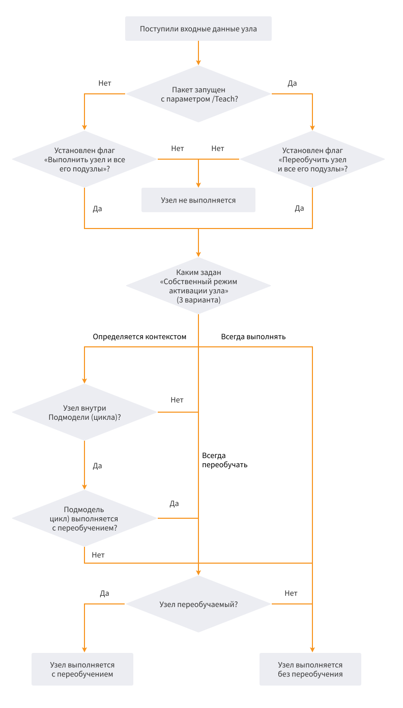

# Режим активации узла

## Варианты активации узла

* [Пакетное выполнение сценария](#paketnoe-vypolnenie-stsenariya);
* [Интерактивное выполнение сценария](#interaktivnoe-vypolnenie-stsenariya).

### Пакетное выполнение сценария

При пакетном выполнении Сценариев для каждого из узлов можно задать следующие варианты выполнения:

* Узел не будет выполняться;
* Узел выполняется без переобучения Модели;
* Узел выполняется с переобучением Модели.

Выбор одного из этих вариантов поведения узла *при пакетном выполнении* задается:

* Контекстом, в котором запускается на исполнение узел Сценария. Под контекстом при пакетном выполнении Сценариев понимаются:
  * Параметры запуска Пакета на исполнение. Значимыми являются следующие факторы:
    * Запуск Пакета с параметром */Teach* или без него;
    * Запуск Пакета с параметром */Node*.
* Настройкой режима активации узла [Подмодели](./../processors/control/supernode.md) ([Цикла](./../processors/control/loop.md)), содержащей исполняемый узел (если таковой имеется).
* Настройкой режима активации, заданной непосредственно для самого исполняемого узла.

> **Примечание:** подробнее о пакетном выполнении сценариев и параметрах пакетного выполнения */Teach* и */Node* (см. [пакетное выполнение сценариев](./batchlauncher.md))

### Интерактивное выполнение сценария

В режиме редактирования (отладки) Сценариев для каждого из узлов можно задать следующие варианты выполнения:

* Узел выполняется без переобучения Модели;
* Узел выполняется с переобучением Модели.

Выбор одного из этих вариантов поведения узла *при интерактивном выполнении* Сценариев задается:

* Контекстом, в котором запускается на исполнение узел Сценария. Под контекстом при интерактивном выполнении Сценариев понимается:
  * Команда, с помощью которой запускается на выполнение сам узел или содержащий его узел Подмодели (Цикла). Возможны следующие варианты:
    * Выполнение команды "Переобучить узел";
    * Выполнение команды "Выполнить узел".
* Настройкой режима активации узла Подмодели (Цикла), содержащей исполняемый узел (если таковой имеется).
* Настройкой режима активации, заданной непосредственно для самого исполняемого узла.

## Настройка режима активации

### Допустимые режимы пакетной обработки

Данная группа параметров влияет на режим активации узла исключительно в пакетном режиме.

* **Выполнить узел и все его подузлы** — флаг определяет, будет ли активироваться узел при пакетном запуске Сценария без переобучения (без параметра /Teach). Для того, чтобы в процессе пакетного выполнения  не активировать узел и все его подузлы, необходимо выключить данный режим.
* **Переобучить узел и все его подузлы** — флаг определяет, будет ли активироваться узел при пакетном запуске Сценария с переобучением (с параметром /Teach). Для того, чтобы в процессе пакетного выполнения  не переобучать узел и все его подузлы, необходимо выключить данный режим.

По умолчанию для новых узлов обе опции включены.

### Собственный режим активации узла

Данный параметр влияет на режим активации узла как в пакетном режиме, так и в интерактивном.
С помощью собственного режима активации можно принудительно задать режим выполнения с переобучением или без переобучения. Предоставляется выбор одного из вариантов:

* **Всегда выполнять** — узел всегда выполняется без переобучения;
* **Всегда переобучать** — узел всегда выполняется с переобучением;
* **Определяется контекстом текущего процесса обработки** (применяется по умолчанию) — режим выполнения с переобучением ("Всегда переобучать") или без переобучения ("Всегда выполнять") определяется следующими факторами:
  * если узел находится внутри Подмодели или Цикла, то режим выполнения наследуется от них.
  * в остальных случаях используется режим выполнения, заданный:
    * в случае пакетного исполнения Сценария — параметром */Teach*;
    * в случае интерактивного исполнения Сценария — командой, с помощью которой запускается на выполнение сам узел ("Переобучить узел" или "Выполнить узел").

> **Примечание:** поскольку Подмодель (или Цикл) также может быть вложен в другую Подмодель, и эта вложенность не ограничена, то, таким образом, может образоваться иерархия вложенности, на вершине которой расположена Подмодель верхнего уровня. По умолчанию настройки этой Подмодели унаследуются всеми подчиненными узлами. Таким образом, собственный режим выполнения узла может быть унаследован от Подмодели самого верхнего уровня.

Следующая *блок-схема* (см. рисунок 1) показывает, какой из вариантов выполнения узла в зависимости от вышеперечисленных настроек будет применен при пакетной обработке:

> **Примечание:** следует иметь в виду, что узел при пакетном выполнении сценария может не выполняться в следующих ситуациях:

* В параметрах запуска пакетного выполнения указан конкретный узел, который будет выполняться (см. параметр [*/Node*](./batchlauncher.md)). При этом выполняются только сам указанный в параметрах узел и все *предшествующие ему узлы* — то есть все узлы, которые участвуют в формировании входных данных для него. Другие узлы Пакета выполняться не будут.
* Один из предшествующих узлов не выполняется. В этом случае входные данные узла не могут быть сформированы, а это означает, что узел не может быть выполнен.