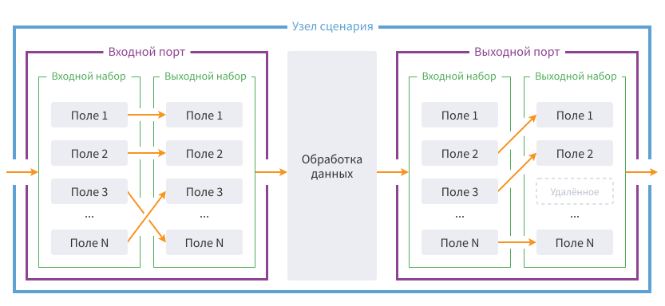

# Ports

**Port**: method of communication between the nodes. В зависимости от структуры передаваемых/принимаемых данных различают следующие типы портов, каждый из которых обозначается иконкой соответствующей формы:

*  Table data;
*  Variables;
*  Data in the hierarchic tree-like form;
*  Parameters of connection to the data source;
*  Data structure is not defined.

Кроме формы, соответствующей определенному типу порта, используются [цветовая индикация состояния и обозначение необязательности порта](#tsvetovaya-indikatsiya-portov), а так же включения/отключения [автосинхронизации](./../../workflow/ports/automapping-of-fields.md).

The Workflow nodes accept data via the input ports and give it back via the output ones. Входные порты на пиктограмме узла сценария располагаются слева, а выходные — справа (см. Figure 1).

Before the node processing data is sent to its input port when it can be preliminarily modified.

Inside the port (refer to рисунок 2) данные так же представлены в виде входного и выходного наборов полей или [переменных](./../variables/README.md), в зависимости от типа порта. The input data set represents the data that is accepted by the port. The output data set represents the data that is given back by the port. When configuring the port, a user has the following possibilities:

* задать произвольную структуру выходного набора — его перечень и параметры полей/переменных;
* сопоставить поля (или переменные) входного набора порта с полями выходного.

It is possible to represent the schema of the data movement for the node that accepts and gives back the data set (table) as follows (refer to Figure 2):

Таким образом, для узла, схема движения данных которого представлена на рисунке 2, данные проходят следующие этапы преобразований:

1. Change of the data structure in the input port and its transfer for processing.
1. Node processing by the algorithm. In the result of the processing, the new data supplied to the output port is generated.
1. Change of the data structure in the output port.

It is possible to introduce the following changes of the data structure in the port:

* изменение имен полей/переменных;
* изменение меток полей/переменных;
* задание порядка полей в таблице;
* удаление ненужных полей/переменных;
* задание назначения полей (см. [features of data set field](./../../data/datasetfieldfeatures.md)).

Эти действия, а также возможные способы реагирования порта на изменение структуры поступающих в порт данных, задаются в настройках порта.

> **Important:** The ports are used not only for data transfer but also for [synchronization](./automapping-of-fields.md).

Одиночным кликом мыши по порту можно открыть диалог для последующего выбора одной из доступных команд:

* **Быстрый просмотр…** — открывает визуализатор [Быстрый просмотр](./../../visualization/preview/quick-view.md). Доступно только для выходных портов.
* **Настроить порт…** — открывает мастер настройки порта.
* **Редактирование метки порта…** — позволяет изменить текущую метку порта на любую другую.

Метка порта будет отображаться в Мастерах некоторых узлов, где по логике возможен выбор входных наборов. Она также будет отображаться и на панели выбора визуализаторов для выходных портов (но сами визуализаторы переименовывать нужно отдельно).

## Port Configuration

Командой **Настроить порт…** открывается окно настройки входных или выходных данных в зависимости от типа порта.

If the structure of the input data supplied to the port is still unknown (for example, if there is no link established with the input port), the port configuration interface provides an opportunity to set only the structure of the output data of the port.

If the input data structure is known, the port configuration interface enables to set the output data structure of the port and map the fields (or variables) of the input data set of the port with the output one. In this case, it is possible to select two different interfaces for mapping:

[Links](./connections-interface.md): graphically displayed links between the fields/variables of the input and output data sets of the port. 

[Table](./table-interface.md): mapping is performed by selecting the input fields/variables in the table.

> **Важно:** по умолчанию при создании нового узла в его портах включена опция [*Автоматическая синхронизация полей*](./automapping-of-fields.md). Usage of this option causes the automatic port configuration (setup). In the result, the output data set of the port fully repeats the input data set structure. The automatic synchronization option is disabled when any of the fields/variables of the output data set of the port is deleted by a user.

## Mechanism of Ports Hiding

In Loginom there is a mechanism of hiding of [execution order ports](./../ports/service-ports.md) and [control variables ports](./../variables/control-variables.md), namely, they are hidden from a user by default:

* To display the execution order ports, it is required to use  toolbar button of the workflow construction area.
* Для отображения портов управляющих переменных необходимо в контекстном меню узла выбрать пункт *Показать порт управляющих переменных*.

## Color-Coded Indication of Ports

The color-coded indication of ports is used in Loginom. Ports with the solid line are required ports, namely, connection with other ports is required for their operation. Рассмотрим цветовую индикацию на примере [*интерфейса Таблица*](./table-interface.md).

* : port is executed;
* : port has been configured but it is not executed;
* : port is not configured or contains an error;
* : port has been partially configured.

The optional port is displayed using the stipple line (their color-coded indication is similar to the required ports)

. No link with another port can be established for such port.

> **Note**: The color-coded indication of the ports of variables, connections and the ports with undefined data structure is similar to the one analyzed above.

## Linking of Ports

Для связывания портов необходимо навести курсор мыши на порт и зажать левую кнопку мыши, после этого вести курсор к тому порту, с которым надо связать, и отпустить левую кнопку мыши.

When selecting the port, the stipple line appears. It starts in the source port and ends in the mouse cursor position. The type of the port with which it is required to link the source port is displayed on its end for convenience (refer to Figure 3):

> **Важно**: можно соединять только порты одного типа, то есть порт *Таблица* может быть соединен только с одноименным портом. It is also prohibited to connect the output port of the node with its own input port. The cyclic links are forbidden!

При добавлении узла в область построения Сценария методом Drag-and-Drop из панели компонентов порты могут быть связаны автоматически.

Если перетаскиваемый компонент находится в области автоматического связывания другого узла, то будет отображаться подсказка с меткой и текущим состоянием выходного порта и связь между соединяемыми портами.

При попытке автосвязывания для портов с типом *Подключение* происходит проверка на корректность связи. Для остальных типов портов проверка корректности связи происходит только в момент добавления узла в Сценарий.

В случае, когда перетаскиваемый узел имеет несколько входных портов, автоматическое связывание может быть выполнено для верхнего входного порта каждого типа.

Автоматическое связываение не будет происходить, если в процессе перетаскивания узла зажать клавишу *Alt*.