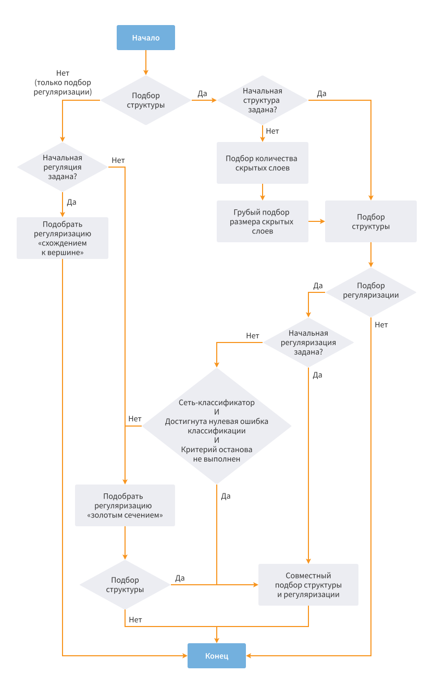

#  Нейросеть (регрессия)

Решает задачу [регрессии](https://wiki.loginom.ru/articles/regression-line.html) — в выходном наборе *Нейросеть* выдаст прогнозируемое значение переменной, зависимое от множества входных параметров.

Перед тем, как производить прогноз, алгоритм обучается на тренировочном наборе данных — [обучающей выборке](https://wiki.loginom.ru/articles/training-set.html). Каждая строка такой выборки содержит:

* в полях, обозначенных как *входные* — множество входных параметров;
* в поле, обозначенном как *выходное* — соответствующее входным параметрам значение [зависимой переменной](https://wiki.loginom.ru/articles/output-variable.html).

Технически обучение заключается в нахождении *весов* — коэффициентов связей между нейронами. В процессе обучения нейронная сеть способна выявлять сложные зависимости между входными параметрами и выходными, а также выполнять обобщение. Это значит, что в случае успешного обучения *Нейросеть* способна выдать верный результат на основании данных, которые отсутствовали в обучающей выборке, а также на неполных и/или «зашумленных», частично искажённых данных. Для обучения используется квазиньютоновский [метод Бройдена-Флетчера-Гольдфарба-Шанно](https://ru.wikipedia.org/wiki/Алгоритм_Бройдена_—_Флетчера_—_Гольдфарба_—_Шанно) с ограниченным использованием памяти L-BFGS.

В задаче регрессии (в отличии от [задачи классификации](./../../processors/datamining/neural-network-classification.md)) *выходными* могут быть только поля с непрерывным [видом данных](./../../data/datakind.md). Вид данных *входных* полей не регламентируется.

> **Примечание:** для каждого непрерывного параметра в структуре *Нейросети* будет создан один вход, в то время, как для каждого дискретного – столько входов, сколько у данного параметра имеется различных уникальных значений.

## Порты

### Вход

*  Входной источник данных (таблица данных).

#### Требования к принимаемым данным

Поля входного набора, которые будут использоваться в качестве *входных* или *выходных*, не должны содержать пропущенные значения. Если это требование не выполнено, то в момент активации узла будет выдана ошибка.

### Выход

*  Выход нейросети (таблица данных) – к входному набору данных добавляется поле с прогнозируемым значением Имя_поля|Прогноз.  
*  [Сводка](./neural-network-regression/report.md) (переменные) – показатели качества модели.

## Мастер настройки

### Шаг 1. Настройка входных столбцов

На первом этапе необходимо задать [назначение](./../../data/datasetfieldfeatures.md) полей входного набора данных.
Для каждого из полей можно выбрать один из вариантов назначения:

*  **Входное** — поле содержит значения одного из входных параметров.
*  **Выходное** — поле содержит целевые значения. В качестве выходного должно быть задано только одно поле набора данных.
*  **Не задано** — поле не участвует в обработке. Устанавливается по умолчанию для прочих полей.

### Шаг 2. Настройка нормализации

На этом этапе входные данные приводятся к определенным диапазонам в соответствии с выбранным алгоритмом [нормализации](./../normalization/README.md). Использование нормализации увеличивает качество и скорость обучения *Нейросети*.

### Шаг 3. Разбиение на множества

На этом этапе входные данные можно разделить на [обучающее](https://wiki.loginom.ru/articles/training-set.html) и [тестовое](https://wiki.loginom.ru/articles/test-set.html)  и множества (выборки).

#### Метод разбиения

* **Случайный** — данные для тестового и обучающего множеств формируется из всего объема входных данных в случайном порядке и случайной пропорции.
* **Последовательный** — соотношение данных для тестового и обучающего множеств задается вручную. Порядок множеств можно менять (кнопки *Сдвинуть вверх*, *Сдвинуть вниз*).
* **По столбцу** — разбиение на обучающее и тестовое множества задаётся при помощи параметра. Параметром выступает столбец с логическим типом данных, где значение &laquo;ИСТИНА&raquo; указывает на то, что запись относится к тестовому набору, а значение &laquo;ЛОЖЬ&raquo; — на то, что запись принадлежит обучающему набору (т.е. можно разбить множество на обучающее и тестовое в узле [Разбиение на множества](../preprocessing/partitioning.md) и подать данные из порта *Общий выходной набор* на вход узла *Нейросеть (регрессия)*, выбрав в качестве параметра разбиения по столбцу колонку "Тестовое множество"). При выборе данного метода таблица выбора соотношения обучающего и тестового множеств становится неактивной.

#### Метод валидации

* Без валидации — [валидация](./../validation.md) обучения *Нейросети* не производится.
* [K-fold кросс-валидация](https://wiki.loginom.ru/articles/cross-validation.html) — входные данные разбиваются на *К* колод (частей). *Нейросеть* обучается на основе всех колод кроме одной, которая  используется для валидации. Обучение повторяется *K* раз, при этом на каждой итерации для валидации используется новая колода.
* [Монте-Карло](https://wiki.loginom.ru/articles/monte-carlo-technique.html) — входные данные случайным образом разделяются на обучающее и валидационное множество в соответствии с заданной пропорцией. Обучение повторяется в соответствии с заданным *Количеством итераций ресемплинга*, при этом для каждой итерации формируется новое валидационное множество (ресемпл).

**Random seed** — начальное число (целое, положительное), которое используется для инициализации генератора псевдослучайных чисел. Последовательность чисел генератора полностью определяется начальным числом. Если генератор повторно инициализируется с тем же начальным числом, он выдаст ту же последовательность чисел.

Параметр влияет на порядок случайного разбиения на тестовое и обучающее множество и на воспроизводимость результата обучения. Можно повторить результат обучения узла, если подать те же данные и выставить тот же random seed.

Для параметра доступны следующие команды:

* Всегда случайно — начальное число всегда будет случайным.
* Генерировать — сгенерируется новое начальное число.
* Копировать — в буфер обмена будет скопировано указанное значение.

### Шаг 4. Настройка параметров Нейросети

#### Структура нейросети

* **Количество скрытых слоев** — предоставляется выбор из списка:
  * Без скрытых слоев.
  * Один скрытый слой (используется по умолчанию).
  * Два скрытых слоя.
* **Количество нейронов в первом скрытом слое** — целое число >= 1 (по умолчанию = 10).
* **Количество нейронов во втором скрытом слое** — целое число >= 1 (по умолчанию = 10).

#### Ограничение на значение выходов

Тип ограничения определяет форму [активационной функции](https://wiki.loginom.ru/articles/activation-function.html) выходного слоя *Нейросети*:

* **Нет** — линейная.
* **Интервал** — гиперболический тангенс.
* **Только снизу** — усеченная снизу экспонента.
* **Только сверху** — усеченная сверху экспонента.

Также возможно задать верхнюю и нижнюю границу ограничения формы активационной функции. Как правило, этот параметр напрямую коррелирует от параметра нормализации входных данных.

#### Параметры обучения

* **Количество рестартов** — число попыток обучения *Нейросети* (на одном и том же наборе), выполняемых из случайных начальных значений весов сети. По завершении всех рестартов выбирается сеть, которая обеспечивает наименьшую среднеквадратическую ошибку на обучающем множестве. Должно быть целым числом >= 1 (по умолчанию = 10).
* **Степень регуляризации** — степень зависимости весов сети друг от друга. Чем больше эта зависимость, тем сильнее будет влияние одного входного параметра на другие. Регуляризация позволяет снизить эффективное число степеней свободы модели, избежав тем самым переобучения. Предоставляется выбор из следующих вариантов:
  * Отсутствует (0).
  * Очень слабая (20).
  * Слабая (40).
  * Средняя (60).
  * Сильная (80).
  * Очень сильная (100).
* **Продолжить обучение** — установление данного флага позволяет начать переобучение модели не со случайных значений весов *Нейросети*, а с полученных при последнем обучении. При этом параметр *Количество рестартов* игнорируется.

#### Критерии останова

Обучение сети происходит итерационно. При каждой итерации считывается весь обучающий набор данных и изменяются веса *Нейросети*. Этот процесс продолжается до тех пор, пока относительные изменения весов не станут меньше заданного порога или количество итераций не превысит заданной величины.

* **Порог минимального изменения весов** — если на очередном шаге обучения относительное изменение нормы вектора весов становится меньше порога, то обучение останавливается. По умолчанию = 0,01.
* **Максимальное количество эпох** — максимальное количество итераций обучения алгоритма. Этот параметр по умолчанию отключен. Если процесс обучения необходимо ограничить по времени, в этом случае он остановится после заданного количества эпох, даже если обучение еще не пришло к оптимальной точке, т.е. не достигнут порог минимального изменения весов.

### Шаг 5. Настройка автоматического подбора параметров Нейросети

*Нейросеть* имеет три подбираемых параметра, относящихся к структуре:

* Количество скрытых слоев (0, 1 или 2);
* Количество нейронов в каждом из скрытых слоев;
* **Степень регуляризации** — параметр, регулирующий жесткость модели.

#### Общие параметры

* **Подобрать структуру** — автоматический подбор структуры *Нейросети*:
  * **Начать с указанной структуры** — использование в качестве начальных параметров значений, заданных на странице настройки параметров *Нейросети*.
* **Подобрать степень регуляризации** — автоматический подбор степени регуляризации *Нейросети*:
  * **Начать с указанной степени регуляризации** — использование в качестве начальной *Степени регуляризации* значения, заданного на странице настройки параметров *Нейросети*.

> **Примечание:** если необходимо осуществлять подбор параметров для больших входных объемов или сложных моделей, можно включить только подбор структуры, либо только подбор степени регуляризации, сократив время на обучение.

#### Параметры выборки

Для ускорения процесса автоподбора предусмотрено задание подвыборки, на которой он будет производиться:

* **Использовать подмножество обучающего набора** — использование подвыборки [обучающего множества](https://wiki.loginom.ru/articles/training-set.html) для автоподбора;
  * **Размер выборки в процентах** — размер подвыборки обучающего множества;
  * **Максимальный размер выборки** — максимальный размер подвыборки обучающего множества.

#### Критерии останова автоподбора

По умолчанию процесс автоматического подбора останавливается при невозможности найти лучшие параметры, чем уже найденные. Для ограничения времени работы предусмотрена возможность ограничить, в том числе одновременно количество шагов автоподбора и время автоподбора:

* **Шагов автоподбора не более** — максимальное количество шагов алгоритма (0 — отключение ограничения);
* **Время автоподбора не более (сек.)** — максимальное время работы алгоритма (0 — отключение ограничения).

>**Примечание:** при работе следует учитывать, что фактически оба ограничения могут быть незначительно превышены при использовании подвыборки для автоподбора, так как последним этапом, который не учитывается ограничениями, будет осуществлено обучение лучшей *Нейросети* на полном наборе.

#### Стратегия оптимизации

Целевой функцией для оптимизатора является среднеквадратическая ошибка на обучающем наборе. При этом для учета случаев, когда несколько сетей показывают сравнимые по точности результаты, в целях выбора сети с самой простой структурой значение целевой функции дополнительно штрафуется на слабо отличающийся от единицы множитель (1+1e-8) за каждый скрытый нейрон.

Стратегия оптимизации следующая:

* Если необходимо подобрать только степень регуляризации для заданной структуры:
  * Если начальная точка не задана, то степень регуляризации подбирается методом *золотого сечения*, в противном случае — методом *схождения к вершине*.
* Если необходимо подобрать только структуру, не изменяя степень регуляризации:
  * Если не задана начальная структура, то она подбирается в два этапа: сначала происходит выбор количества скрытых слоев (0, 1 или 2), затем, если результат предыдущего этапа не 0, грубо подбирается размер скрытых слоев методом *золотого сечения*, причем для 2 скрытых слоев количество нейронов на данном этапе делается одинаковым;
  * Структура подбирается сразу по всем трем параметрам (число слоев, число нейронов) методом *схождения к вершине* из заданной, либо подобранной начальной точки.
* Если необходим автоподбор структуры и регуляризации:
  * Подбирается структура так же, как и в предыдущем пункте. При этом, если начальное значение регуляризации задано, то используется оно, в противном случае — регуляризация отключена.
  * Если начальное значение регуляризации не было задано, оно подбирается методом *золотого сечения*.
  * Финальный этап автоподбора производится методом *схождения к вершине* по всем четырем параметрам.

Блок-схема (граф переходов) реализованной стратегии автоподбора указана на рисунке ниже.

