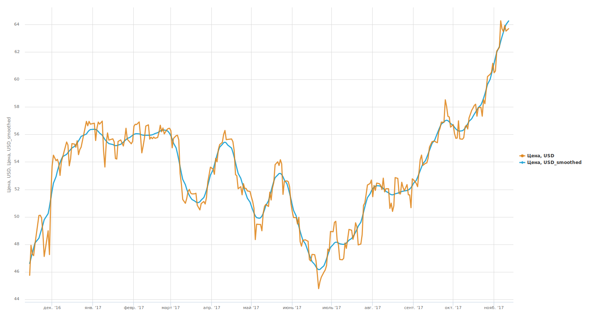

#  Сглаживание

## Описание

Компонент предназначен для сглаживания численных рядов данных и выделения трендовой составляющей. Для этих целей в нем можно использовать *фильтр Ходрика-Прескотта* или один из трех типов вейвлетов — *вейвлеты Добеши, Койфлеты и CDF 9/7*. Имеется возможность сглаживания рядов с пропущенными данными, при этом [фильтр Ходрика-Прескотта](https://wiki.loginom.ru/articles/hodrickprescott-filter.html) подставляет вместо пропусков значения, которые обеспечивают максимальную гладкость в смысле функционала фильтра, а в случае [*вейвлет-сглаживания*](https://wiki.loginom.ru/articles/wavelet-transform.html) пропуски предварительно интерполируются линейно.

%spoiler%Пример%spoiler%

На данной диаграмме оранжевым цветом изображен график, соответствующий исходному ряду данных (динамика цен на нефть марки Brent), а синим — исходный ряд, обработанный компонентом *Сглаживание* с помощью *фильтра Ходрика-Прескотта* с параметром Lambda, равным 100. 

%/spoiler%

## Порты

### Вход

*  **Входной источник данных** — таблица данных. Входные данные должны соответствовать следующим требованиям: [тип данных](./../../data/datatype.md) поля должен быть *целый* или *вещественный*, [вид данных](./../../data/datakind.md) — *непрерывный*.

### Выход

*  **Выходной набор данных** — исходная таблица, к которой добавлены поля со сглаженными рядами; метки таких полей снабжены постфиксами *_smoothed*.

## Мастер настройки

Предоставляет список численных полей, содержащихся во входной таблице. Поля, ряды которых требуется сгладить, следует отметить флагами, после этого в столбце *Метод обработки* для каждого выбранного поля можно задать метод сглаживания:

* **Фильтр Ходрика-Прескотта** — имеет два взаимосвязанных параметра (одновременное редактирование параметров исключено), радиокнопки переключают на редактирование одного из них:
  * **Параметр Lambda** — основной коэффициент фильтра, с увеличением которого возрастает сглаживание ряда (при Lambda → ∞ итоговый ряд превращается в линейный тренд, а при Lambda = 0 ряд совпадает с исходным рядом). Может принимать значения вещественного типа в диапазоне [0.0625, 1026598E+8] с шагом 0.1. Значение 1026598E+8 рассчитано на основе максимального значения *Периода сглаживания*.
  * **Период сглаживания** — значение вещественного типа в диапазоне [2, 20000] с шагом 0.1. Значение по умолчанию — 39.7 (рассчитано на основе значения по умолчанию Lambda, равного 1600).
* **Вейвлет-сглаживание** — *тип вейвлета* определяется радиокнопкой: *Добеши, Койфлеты, CDF 9/7*. Настройки всех вейвлетов идентичны:
  * **Порядок вейвлета** — определяет гладкость восстановленного ряда данных: чем меньше значение параметра, тем сильнее будут выражены «выбросы», и, наоборот, при больших значения параметра «выбросы» будут сглажены. Для *вейвлета Добеши* этот параметр может принимать значения от 1 до 10, для *Койфлетов* — от 1 до 5, *вейвлетом CDF 9/7* этот параметр не используется.
  * **Продолжение границ** — метод устранения искажений на границах ряда при сглаживании:
    * Симметричное;
    * Антисимметричное;
    * Продолжение нулями;
    * Константное;
    * Периодическое;
    * Симметричное без крайней точки;
    * Антисимметричное без крайней точки.
  * **Глубина разложения** — определяет «масштаб» отсеиваемых деталей: чем больше эта величина, тем более «крупные» детали в исходных данных будут отброшены. Использование слишком больших значений глубины разложения может привести к потере полезной информации из-за слишком большой степени «огрубления» данных. Параметр может принимать значения от 1 до 10.
